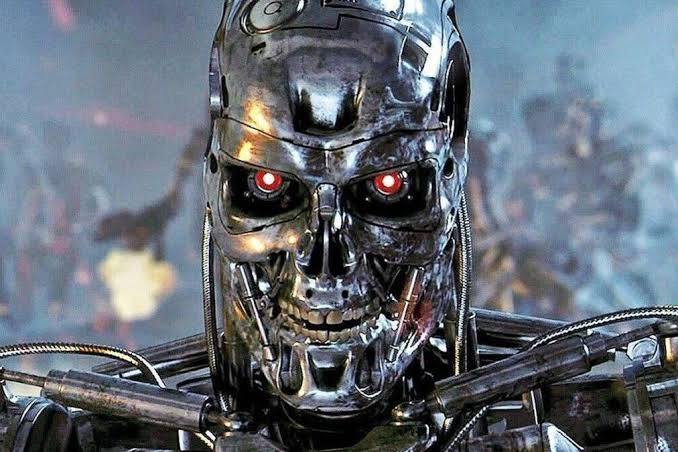

# IA Developer

## Videos & Leccione🎥

**#1 ¿Se puede hacer un agente de IA en Go? Curso completo: herramientas, el bucle y streaming**

Link: **[www.youtube.com/watch?v=y31JMF10uqk](https://www.youtube.com/watch?v=y31JMF10uqk)**

path: /agente_go_first_class

En este video aprendemos con el sdk de anthropic al manejo de peticiones al modelo y loop de acciones.

**#2 ¿Qué es MCP? Explicado con diagramas + tu primer servidor en Go**

Link: **[https://www.youtube.com/watch?v=4UxCZO8bsuE](https://www.youtube.com/watch?v=4UxCZO8bsuE)**

path: /que_es_un_mcp_primer_servidor_mcp_golang

Servidor basico MCP para decir hola a una persona mediante dos input Nombre Apellido testeado y probado con **@modelcontextprotocol/inspector**
